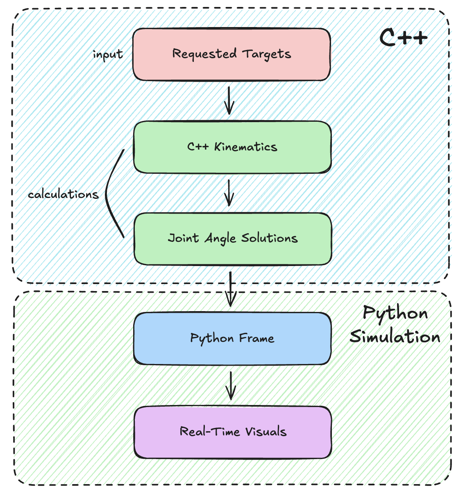

# Model-Based Robotic Arm Control System

**2-DOF planar robotic arm** with forward and analytic inverse kinematics, joint-space trajectory planning, and constrained motion execution.

<div align="center" style="margin: 12px 0;">
  <table border="0" cellpadding="0" cellspacing="0" style="border-collapse: collapse; border: none;">
    <tr>
      <td align="center" valign="top" style="padding-right: 16px; border: none;">
        
        <div><sub>GIF of the arm moving through all solutions</sub></div>
      </td>
      <td align="center" valign="top" style="padding-left: 16px; border: none;">
        
        <div><sub>System flow diagram</sub></div>
      </td>
    </tr>
  </table>
</div>

---

## Overview

This project implements a **model-based control stack** for a 2-DOF planar robotic arm, demonstrating **core robotics principles** used in real systems including:
- Forward & inverse kinematics
- Code Tests
- Analytic IK
- Joint-space trajectory planning
- Clean separation between math, planning, and visualization

The system is designed as a **foundation** for future projects.

Each stage has a **single responsibility**, demonstrating the engineering process for robotics.

---

## Kinematic Model

### "Robot" Description

- Planar arm (2-link)
- Link lengths:  
  - `L₁`: shoulder → elbow
  - `L₂`: elbow → end effector
- Joint angles:
  - `θ₁`: base joint
  - `θ₂`: elbow joint

---

## Forward Kinematics (FK)

Forward kinematics maps joint angles to end-effector position:

```math
x = L_1 \cos(\theta_1) + L_2 \cos(\theta_1 + \theta_2)
```

```math
y = L_1 \sin(\theta_1) + L_2 \sin(\theta_1 + \theta_2)
```

This is implemented directly and used for:
- Validating IK solutions
- Drawing the arm in the simulation

---

## Workspace Analysis

Before solving IK, the system checks whether a target is **physically reachable**.

Let:

```math
r = \sqrt{x^2 + y^2}
```

A target is reachable **if and only if**:

```math
|L_1 - L_2| \le r \le L_1 + L_2
```

### Interpretation

- **Outer circle** (`L₁ + L₂`) → maximum arm reach
- **Inner circle** (`|L₁ - L₂|`) → minimum arm reach
- Targets inside the inner circle or outside the outer circle are **unreachable**

Unreachable targets are:
- Flagged programmatically
- Skipped automatically during motion planning

---

## Inverse Kinematics (IK)

This project uses **analytic inverse kinematics**, not iterative numerical solvers.

### Elbow Angle

```math
\cos(\theta_2) = \frac{x^2 + y^2 - L_1^2 - L_2^2}{2 L_1 L_2}
```

This produces **two solutions/configurations**:

- Elbow-up ($+$)
- Elbow-down ($-$)

```math
\theta_2 = \pm \arccos(\cdot)
```

### Shoulder Angle

```math
\theta_1 =
\arctan2(y, x) -
\arctan2\left(
L_2 \sin(\theta_2),
L_1 + L_2 \cos(\theta_2)
\right)
```

Each reachable target produces **0, 1, or 2 valid joint configurations**.

---

## Trajectory Planning

Motion between targets is planned in **joint space**, not Cartesian.

Why joint space?
- Avoids singularities
- Guarantees valid motion
- Matches how real robots operate

For each target a smooth interpolation is generated between joint configurations.

---

## Simulation & Visualization

The simulation layer:
- Draws the arm at every timestep
- Outer workspace boundary
- Inner unreachable region
- Reachable vs unreachable targets
- Animates joint-space motion

Unreachable targets are never passed into the IK or planner

This ensures **correct construction behavior**.

---

## Engineering Focus

This project intentionally emphasizes:

- **Mathematical closed-form solutions**
- **Clear interfaces** between system layers
- **Scalability** for higher-DOF systems
- **Testability**

This project is designed to reflect how robotics systems are built in:
- The industry/workforce
- Research platforms

---

## Tech Stack

- **C++** — kinematics, math, core logic
- **Python** — simulation, visualization, animation
  - **Matplotlib** — plotting & workspace visualization

---

## What I learned

This project helped me develop a **foundation for robotics projects**.

I learned to demonstrate:
- An understanding of robotic geometry
- Comfort with analytic math
- System-level thinking
- Exposure to real robotic software stacks
